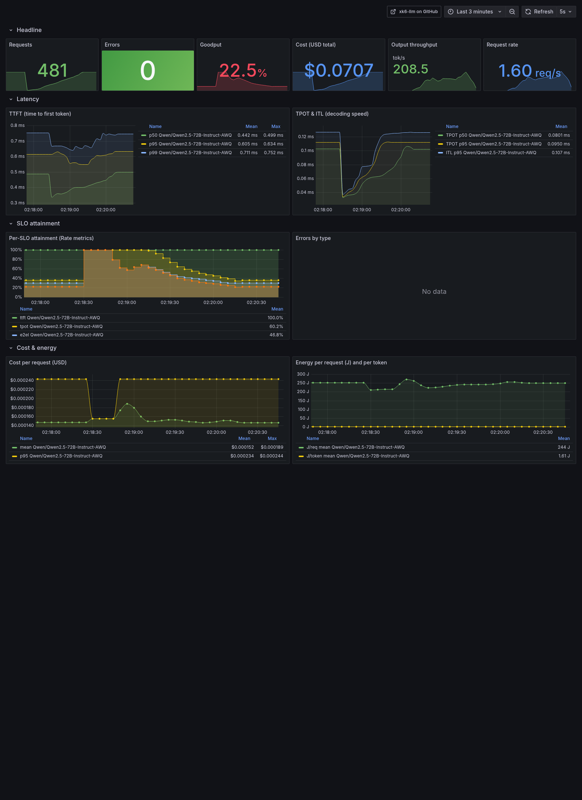

# xk6-llm

A k6 extension for load-testing LLM inference servers. Streaming TTFT/ITL/TPOT, goodput, cost, and energy metrics for any OpenAI-compatible server.



*1,470 requests, 0 errors, 100% goodput, $0.382 total cost. Three-turn conversations against `ibm-granite/granite-4.1-30b` on a single NVIDIA B300 SXM6. The "TTFT by turn" panel surfaces prefix-cache speedup across turns; the cost and energy panels are derived from server-reported token counts.*


*Recorded against Ollama on an M3 MacBook Air. The same script and dashboard work against a hosted API or a vLLM cluster; only the numbers change.*

## Build

```bash
go install go.k6.io/xk6/cmd/xk6@latest
xk6 build --with github.com/msradam/xk6-llm@latest --output build/k6
./build/k6 version
```

## Example

```js
import llm from 'k6/x/llm';

const client = new llm.Client({
  base_url: 'http://localhost:11434/v1',
  model:    'granite4.1:3b',
});

export default async function () {
  const res = await client.chat({
    messages:   [{ role: 'user', content: 'Write a haiku about Poisson arrivals.' }],
    max_tokens: 128,
    temperature: 0,
  });
  console.log(`ttft=${res.ttft_ms.toFixed(1)}ms tpot=${res.tpot_ms.toFixed(1)}ms tokens=${res.completion_tokens}`);
}
```

```bash
./build/k6 run examples/chat.js
```

## Metrics

Every metric is tagged `model`. Errors are additionally tagged `error_type`. Per-request `cache_state` and arbitrary `tags` are propagated when supplied.

| Name | Type | Description |
|---|---|---|
| `llm_requests` | Counter | Successful chat completions. |
| `llm_errors` | Counter | Failures. Tag `error_type` in `{network, timeout, http_4xx, http_5xx, stream, decode}`. |
| `llm_request_duration` | Trend (Time) | End-to-end wall time. |
| `llm_response_headers` | Trend (Time) | Submit to HTTP response headers. |
| `llm_ttft` | Trend (Time) | Time to first token. First content-bearing SSE chunk; role-only deltas skipped. |
| `llm_itl` | Trend (Time) | Per-chunk inter-arrival vector. First sample is `t[chunk₂] - t[chunk₁]`. |
| `llm_tpot` | Trend (Time) | Scalar `(e2e - ttft) / (n - 1)`. Emitted only when `completion_tokens > 1`. |
| `llm_chunks_per_request` | Trend | Content chunks per request. |
| `llm_prompt_tokens` | Counter | Server-reported `usage.prompt_tokens`. |
| `llm_completion_tokens` | Counter | Server-reported `usage.completion_tokens`. |
| `llm_goodput` | Rate | All SLOs met. Emitted only when an `slo` predicate is supplied. |
| `llm_slo_ttft` | Rate | `ttft_ms <= slo.ttft_ms`. |
| `llm_slo_tpot` | Rate | `tpot_ms <= slo.tpot_ms`. |
| `llm_slo_e2el` | Rate | `duration_ms <= slo.e2el_ms`. |
| `llm_cost_usd` | Trend | USD per request. Emitted only when `cost` is supplied. |
| `llm_energy_j` | Trend | Estimated joules per request. Emitted only when `energy` is supplied. |
| `llm_energy_j_per_token` | Trend | `llm_energy_j / completion_tokens`. |

## API

### `new llm.Client(opts)`

```ts
{
  base_url?:   string,                          // default: http://localhost:11434/v1
  api_key?:    string,
  model?:      string,
  timeout_ms?: number,                          // default: 60000
  ignore_eos?: boolean,
  headers?:    Record<string, string>,
  slo?:        { ttft_ms?, tpot_ms?, e2el_ms? },
  cost?:       { usd_per_million_input_tokens?, usd_per_million_output_tokens? },
  energy?:     { j_per_input_token?, j_per_output_token?, idle_w? },
}
```

### `client.chat(req)`

`req` accepts the OpenAI chat-completion fields (`messages`, `max_tokens`, `temperature`, `top_p`, `seed`, etc.) plus optional `slo`, `cache_state`, and `tags`. Returns a Promise resolving to:

```ts
{
  content:             string,
  ttft_ms:             number,
  itl_ms:              number[],
  tpot_ms:             number,
  duration_ms:         number,
  response_headers_ms: number,
  chunks:              number,
  prompt_tokens:       number,
  completion_tokens:   number,
  finish_reason:       string,
}
```

### `new llm.Dataset(opts)`

Replays a JSONL prompt corpus. One line per request: `{"messages": [...], "max_tokens"?: N, ...}`. Loaded once per process and cached by absolute path.

```ts
{
  path:     string,
  seed?:    number,    // default: 42
  shuffle?: boolean,
}
```

Methods: `dataset.size()`, `dataset.next()`, `dataset.at(i)`, `dataset.reset()`.

A converter for ShareGPT V3 to this format lives at `scripts/sharegpt_to_jsonl.py`.

## What you can simulate

k6 is a Go binary that executes test scripts written in JavaScript (TypeScript supported), so a single VU can carry conversation state, branch on responses, and drive multi-call workflows in user code. xk6-llm doesn't define a session or agent abstraction; instead, the patterns live in [`examples/`](./examples/) and use the existing `Client` plus k6's `tags` to make the workflow visible in the dashboard.

| Example | What it shows |
|---|---|
| [`multi-turn.js`](./examples/multi-turn.js) | A 5-turn conversation per VU iteration. Tags `cache_state` and `turn` on every call so the dashboard can show TTFT degradation across turns and prefix-cache speedup (typically 5 to 15x by turn 5). |
| [`agent.js`](./examples/agent.js) | Tool-calling loop. Model emits `TOOL: name(arg)` or `DONE: answer`; the script runs the tool, feeds the result back, repeats. Tags `agent_id` and `iteration` so the dashboard rolls up per-session totals and full-envelope p95. |
| [`rag.js`](./examples/rag.js) | Embed -> vector retrieve -> generate. Each phase has its own k6 Trend (`rag_embed_ms`, `rag_retrieve_ms`) with independent SLO thresholds. Set `EMBED_URL` and `RETRIEVE_URL` to point at real services. |
| [`ab-providers.js`](./examples/ab-providers.js) | Two `Client` instances under two scenarios with different `cost` configs. Identical traffic, side-by-side latency and dollar-cost panels. Procurement decision in one screenshot. |

## Quickstart with Grafana

A Docker Compose stack with a pre-provisioned dashboard is in [`quickstart/`](./quickstart/). See [`QUICKSTART.md`](./QUICKSTART.md).

## Validation

Cross-validated against `vllm bench serve` on a real vLLM 0.21.0 server (Qwen2.5-72B-Instruct-AWQ, A100 80GB). TPOT/ITL/E2EL agree within 5% on identical workloads; token counts are bit-exact with vLLM `/metrics`. Numbers and methodology in [`docs/validation-parity.md`](./docs/validation-parity.md) and [`docs/validation-results.md`](./docs/validation-results.md).

## Compatibility

| xk6-llm | k6 | xk6 |
|---|---|---|
| v0.x | v2.0.0 | 1.4.1 |

## Attribution

This codebase was developed with assistance from [Claude Code](https://claude.com/claude-code). PRs are reviewed and merged by humans.

## License

Apache-2.0
